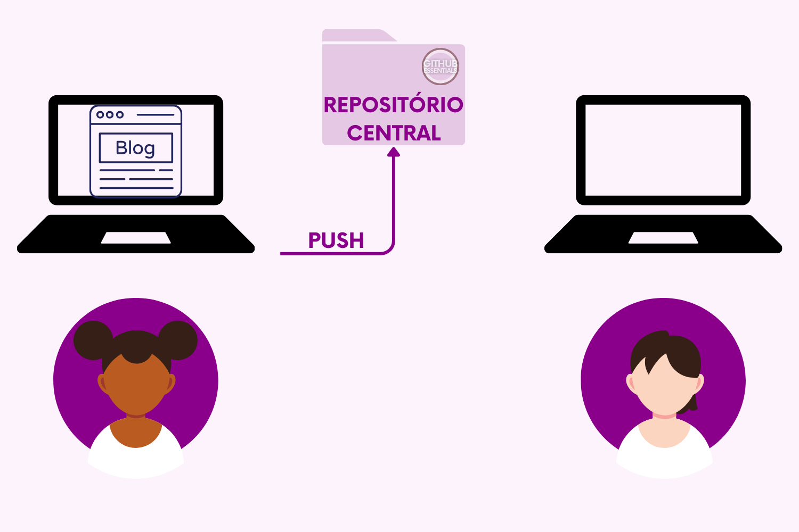
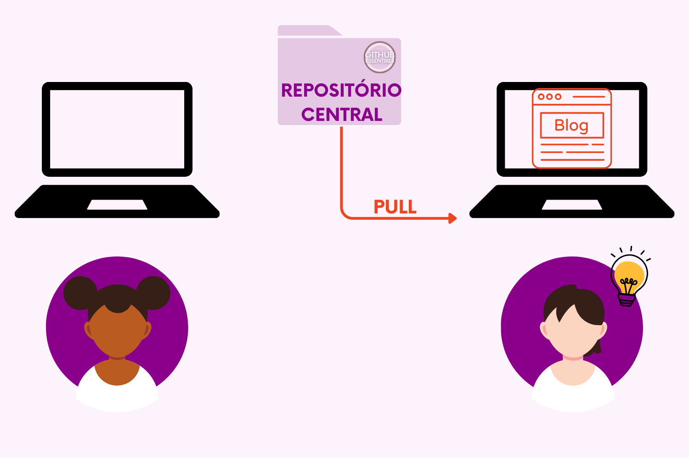
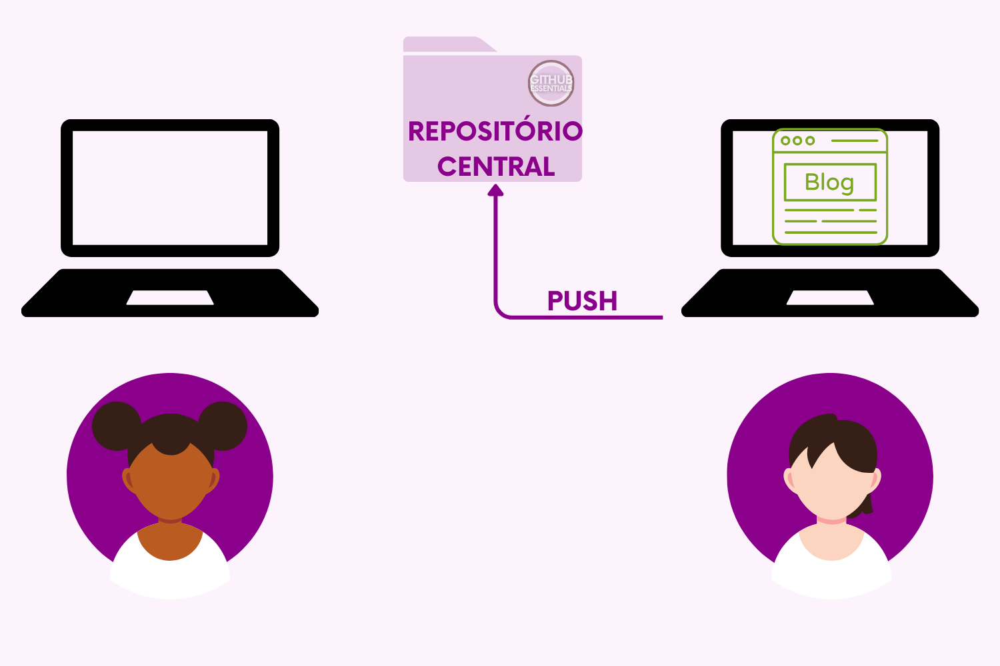
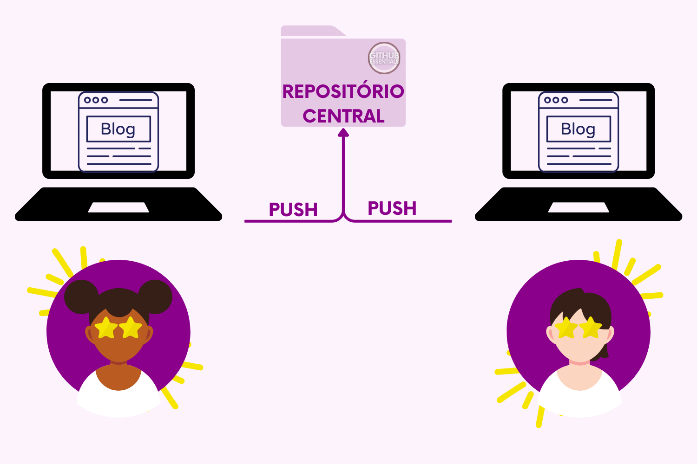
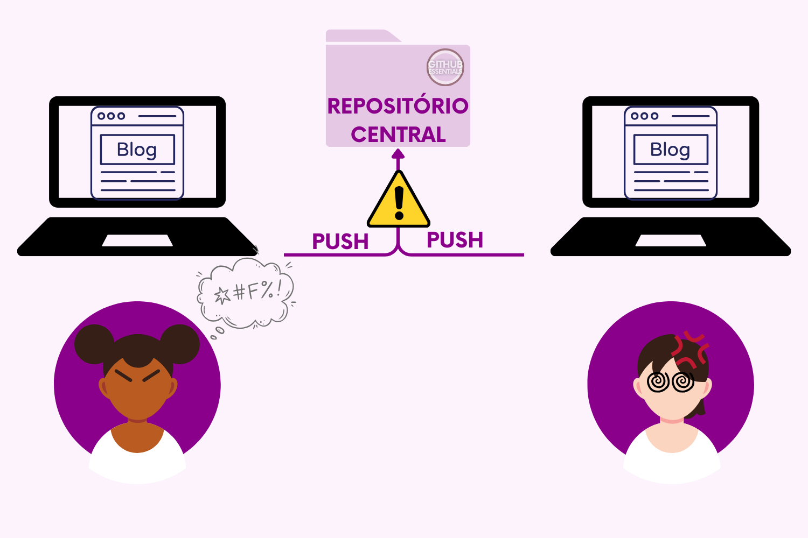

# 2.1.1 Sistemas de controle de versão centralizados

O Git, sistema de controle de versão que iremos estudar neste livro, é um sistema distribuído. Para entender a motivação de como o Git foi construído e de como ele funciona, vale a pena conhecer primeiro como era feito antes dele.

### **Entendendo os Sistemas de Controle de Versão Centralizados**

A primeira solução para Sistemas de Controle de Versão consistiu em uma arquitetura **centralizada**, com um único repositório central onde todo o histórico de alterações e versões do código era armazenado.

Pense nesse repositório central como uma pasta gigante que contém todos os documentos do seu projeto. Não só a versão mais recente, mas também todas as versões anteriores e informações sobre cada uma delas. É como se fosse uma pasta que guarda toda a linha do tempo do seu projeto.

<figure><figcaption>
Grande pasta que contém os arquivos e suas versões
</figcaption></figure>

Agora, você pode estar se perguntando como várias pessoas poderiam trabalhar nesse projeto ao mesmo tempo. Bem, o repositório central normalmente fica em um outro computador (servidor), para que mais pessoas possam acessá-lo. Caso contrário, todos teriam que compartilhar o mesmo computador.

<figure><figcaption>
Servidor: onde a "Grande Pasta" fica localizada
</figcaption></figure>

Cada pessoa que for trabalhar no projeto precisa baixar a versão mais recente de todos os arquivos para o seu computador.

<figure><figcaption>
Usuário 2 fazendo a cópia atualizada do Repositório Central do Servidor
</figcaption></figure>

Depois, faz as alterações necessárias localmente. Em seguida, envia de volta apenas os arquivos modificados, adicionados ou removidos — ou seja, **apenas as alterações são enviadas**.&#x20;

O projeto inteiro **não é reenviado**, nem os arquivos que não sofreram mudanças. O repositório central, que fica no servidor, é responsável por manter todo o histórico do projeto.

Vamos entender como seria o fluxo de trabalho com um exemplo.

### Exemplo de Fluxo de Trabalho

Uma pessoa **A** e uma pessoa **B** decidem criar um blog. A pessoa **A** cria uma estrutura inicial do blog em seu computador e envia ("_**PUSH**_") essa versão para o repositório central.

<figure><figcaption></figcaption></figure>

A pessoa **B** se anima com o projeto e também quer contribuir, criando o seu primeiro blog post. Para isso, **B** precisa ter acesso à versão criada por **A**, que já está no repositório central no momento. **B** precisa fazer um "_**PULL**_", que nada mais é que fazer uma cópia da última versão do projeto que está no repositório central para a sua máquina local.

<figure><figcaption></figcaption></figure>

Agora, **B** tem acesso, em seu computador, ao projeto em sua versão mais atual. **B** escreve seu primeiro blog post e precisa enviar as mudanças de volta para o repositório central, para que **A** também possa ver o seu belo trabalho. **B** faz um "_**PUSH**_" do seu código, ou seja, envia uma cópia da sua versão para o repositório central

<figure><figcaption></figcaption></figure>

Tudo pronto! Temos no repositório central a versão mais recente do blog, a qual contém o post de **B**. A versão inicial de **A** também está lá, guardada caso alguém precise consultá-la para comparar diferenças, ou até mesmo para reverter alguma alteração.

<figure><figcaption></figcaption></figure>

Mas, e se **A** também estiver empolgado e não conseguir esperar por **B**? Ao mesmo tempo que **B**, **A** começa a escrever seu próprio post. Quando **A** tenta enviar seu código para o repositório central, percebe que **B** já enviou antes a sua versão.

<figure><figcaption></figcaption></figure>

E para piorar, **A** e **B** modificaram o mesmo arquivo! E agora?

<figure><figcaption></figcaption></figure>

Bom, é aí que entra em jogo umas das principais funcionalidades de um sistema de controle de versão: o auxílio no Gerenciamento de Conflitos. O sistema lida com as mudanças feitas por diferentes colaboradores no mesmo arquivo, evitando conflitos e garantindo uma integração suave das alterações. Isso é feito por meio de um processo chamado 'mesclagem', que combina o trabalho de todos de forma harmoniosa e mantém a consistência do projeto.

Dessa forma, **A** consegue tranquilamente enviar suas modificações sem comprometer em nada as mudanças feitas por **B**.

<figure><figcaption></figcaption></figure>

### &#x20;:bulb: Conceitos Básicos de Controle de Versão Centralizado: &#x20;

1. **Repositório Centralizado**: É o ponto central onde todo o código-fonte e histórico de versões são armazenados. Todos os desenvolvedores trabalham diretamente com este repositório para obter versões atualizadas do código e para enviar suas alterações.
2. **PUSH e PULL**: Os desenvolvedores fazem um PULL - "puxam" para si uma cópia do código do repositório central para trabalhar localmente em suas máquinas. Após fazerem suas alterações, eles dão PUSH e mandam suas modificações de volta para o repositório central.
3. **Auxílio no Gerenciamento de Conflitos**: Os sistemas centralizados gerenciam as mudanças concorrentes feitas por múltiplos desenvolvedores. Se dois desenvolvedores tentarem modificar o mesmo arquivo ao mesmo tempo, o sistema de controle de versão pode detectar e gerenciar essas conflitos.
4. **Histórico de Versões**: Um aspecto fundamental dos sistemas de controle de versão é a capacidade de acompanhar o histórico de alterações em um arquivo ao longo do tempo. Isso permite que os desenvolvedores voltem a versões anteriores do código, se necessário.

<figure><figcaption>
Mapa do funcionamento de um Sistema de Controle de Versão Centralizado
</figcaption></figure>

Exemplos de sistemas centralizados de controle de versão incluem o Subversion (SVN) e o Microsoft Team Foundation Version Control (TFVC). Embora os sistemas centralizados tenham sido amplamente utilizados no passado, muitas equipes estão migrando para sistemas de controle de versão distribuídos, como o Git, devido à sua flexibilidade, desempenho e recursos avançados que iremos começar a desvendar aos poucos daqui para frente.
