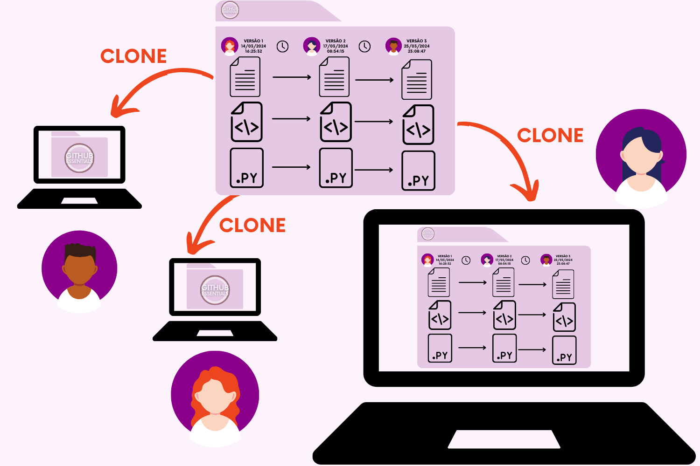

# VCS Distribuídos (DVCS)

### **Sistemas Distribuídos**&#x20;

Os Sistemas de Controle de Versão Distribuídos (DVCS - _Distributed Version Control Systems_) são uma evolução dos sistemas centralizados. Neles, cada pessoa colaboradora faz a cópia do repositório central integralmente, obtendo assim o histórico completo do projeto em seu próprio computador.&#x20;

<figure><figcaption>
Relembrando: Repositório Central = "Grande Pasta" que contém os arquivos, versões e metadados
</figcaption></figure>

Diferentemente dos sistemas centralizados, onde apenas a versão mais recente é disponibilizada, neste modelo, cada cópia (clone) contém não apenas os arquivos do projeto, mas também todos os metadados associados ao repositório original.

<figure><figcaption>
Cada "Clone" faz uma cópia integral de todos os arquivos existentes
</figcaption></figure>

A estrutura distribuída foi criada para endereçar a maior parte dos problemas percebidos nos sistemas centralizados.

### Motivação: endereçar problemas dos sistemas centralizados

**Um único ponto de falha coloca em risco os dados**

No sistema centralizado, caso algo venha a acontecer com o servidor e o repositório central for comprometido, isso resulta em uma perda definitiva do código.

Já no sistema distribuído, como cada pessoa colaboradora possui uma cópia completa do repositório em seu computador, tendo acesso a todo o histórico, é possível restaurar o projeto a partir de suas cópias locais.

**Necessidade de conexão com o servidor**

As pessoas dependem do acesso contínuo ao servidor central para realizar operações de controle de versão no sistema centralizado. Se o servidor ficar inacessível, por exemplo, todas as atividades de trabalho ficam interrompidas.

No sistema distribuído, entretanto, não há essa dependência de conexão com o servidor. Isso significa que a maior parte do desenvolvimento pode ser realizada _offline_. Apenas as operações de enviar (_**push**_) e receber (_**pull**_) modificações que ficam restringidas a necessidade de uma conexão.

As pessoas colaboradoras têm acesso ao histórico completo do projeto em seus próprios computadores, permitindo que façam alterações diretamente em seus repositórios locais. Isso possibilita que realizem suas modificações como um conjunto de alterações, adiando o envio para quando estiverem online novamente.

**Conexão lenta atrasa o desenvolvimento**

Em sistemas centralizados, os usuários enfrentam dificuldades ao realizar mudanças devido à comunicação necessária com o servidor remoto, o que torna o processo mais lento, especialmente em conexões de rede lentas.&#x20;

Por outro lado, em sistemas distribuídos, os usuários podem fazer alterações de forma ágil e autônoma em seus repositórios locais, permitindo trabalhar sem depender constantemente do servidor remoto, realizando suas modificações como um conjunto de alterações, adiando o envio para quando estiverem online novamente.

**Poucos momentos estáveis para enviar mudanças (push)**

Quando muitos pessoas precisam trabalhar na mesma parte do código, fica complicado decidir quando fazer as alterações. Se as mudanças ainda não estão estáveis, não podem ser enviadas para o local onde todos compartilham o código, então cada desenvolvedor precisa mantê-las guardadas no seu próprio computador até que estejam prontas.

Essa demora em compartilhar as mudanças pode atrasar o projeto e causar conflitos quando diferentes partes do código são mescladas. Isso acontece porque outros membros da equipe não conseguem ver as alterações que só existem no computador das outras pessoas. Quando finalmente as mudanças são enviadas para o local compartilhado, é preciso resolver esses conflitos rapidamente para que todos possam continuar trabalhando juntos.&#x20;

Nos sistemas de controle de versão distribuído é mais fácil criar diferentes versões do código, chamadas de ramificações (branches). Isso porque cada pessoa tem uma cópia completa do histórico do projeto no seu próprio computador. Elas podem experimentar novas ideias rapidamente e pedir opiniões sobre o código antes de unir suas mudanças ao projeto principal.&#x20;

Com menos pessoas trabalhando na mesma parte do código, os conflitos são menos comuns. Além disso, ter acesso ao histórico completo torna-se mais fácil encontrar erros, ver o que foi modificado e até voltar para uma versão anterior do código, se necessário.

### Visão Geral

Um sistema de controle de versão distribuído descentraliza o processo de gerenciamento de projetos, passando de um único repositório central ou servidor para um modelo onde cada membro da equipe possui uma cópia completa do projeto em seu próprio repositório local. Isso não apenas aprimora o fluxo de trabalho de desenvolvimento por meio de mesclagens e ramificações rápidas, mas também mitiga significativamente os riscos associados a uma falha no banco de dados central, garantindo que cada participante tenha uma cópia de backup do histórico completo.

Os DVSCs oferecem mais flexibilidade, segurança e eficiência em comparação com os sistemas centralizados. A integração deles no processo de desenvolvimento de software marcou um avanço fundamental na forma como as equipes colaboram e gerenciam seu histórico de controle de versão.

<figure><figcaption>
Mapa do Funcionamento de um Sistema de Controle de Versão Distribuído
</figcaption></figure>
