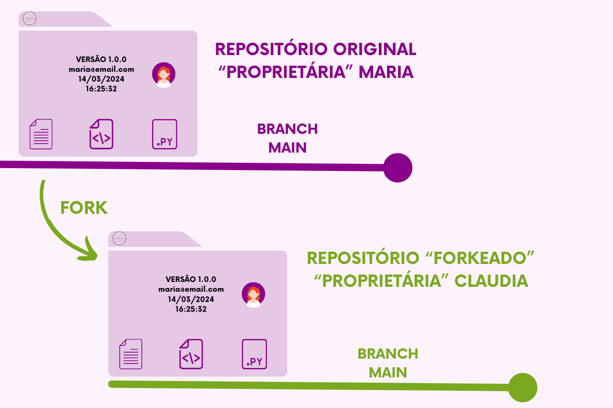

# Fork

#### :flag\_br: Bifurcação, encruzilhada

O fork em um sistema de controle de versão, como o Git, é utilizado para permitir que um usuário faça uma cópia independente de um repositório existente. Ele copia os arquivos originais e cria um repositório idêntico, na conta de outro usuário. Suas principais funções são:

1. **Desenvolvimento Independente**: Um fork permite que um usuário crie uma cópia separada de um repositório existente. Isso permite que o usuário desenvolva funcionalidades, faça correções ou experimente alterações sem afetar diretamente o repositório original. Essa independência é útil, especialmente em projetos de código aberto, onde diferentes colaboradores podem ter diferentes visões ou abordagens para o projeto.&#x20;

<figure><figcaption>
Claudia adorou o repositório que a Maria fez, mas queria incluir algumas funcionalidades que no seu dia a dia faria mais sentido. Primeiro ela faz o fork e traz para si o repositório com todos os dados e metadados presentes no Repositório Original. 
</figcaption></figure>

1. **Contribuição para Projetos de Código Aberto**: Em projetos de código aberto hospedados em plataformas como o GitHub, os forks são frequentemente usados para permitir que os colaboradores que ainda não possuem acesso à efetuar alterações no projeto principal. Um colaborador faz um fork do repositório original, faz as alterações desejadas em sua própria cópia do repositório e, em seguida, envia uma solicitação para que suas alterações sejam revisadas e, potencialmente, mescladas de volta ao repositório original.

<figure><figcaption>
Perceba: o Repositório Original continua da mesma forma, sem qualquer alteração, enquanto o repositório da Claudia é atualizado por ela com as features necessárias para uso próprio. Ela é muito prevenida, e  mesmo no seu fork abriu a branch <code>feature1</code> para poder desenvolver seu código sem dores de cabeça futuros. 
</figcaption></figure>
