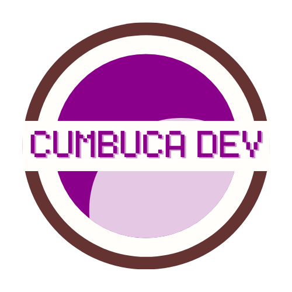

# Cumbuca Dev

Antes de começarmos, precisamos nos apresentar, certo?

Suas instrutoras nesse curso serão: Camila Maia e Maria Antônia Maia - caso você não tenha percebido as semelhanças: somos primas e parceiras nesse projeto incrível chamado **Cumbuca Dev**.

\***Aqui eu tinha pensado em colocar seu grande CU-rriculo**\*\*\*

\*\* **aqui meu mini cu-rrisco**\*

O projeto nasceu de uma demanda pessoal, Camila estava mentorando a Maria para fazer a transição de carreira para o mercado de TI. Acontece que nada era tão simples quanto parecia, e mesmo com algum tempo de estudo a Maria não conseguia enxergar um panorama em que alcançaria alguma vaga real de emprego na área de T.I. Passou em alguns bootcamps, cursos imersivos, programas de iniciação... mas a vaga de emprego sempre ia para pessoas com o mesmo perfil.&#x20;

Desanimada e brocochô, a Maria até pensou em desistir de tudo e continuar nos empregos convencionais - que na região além de serem escassos, não permitiam o desenvolvimento e crescimento pessoal. Foi então que a Camila resolveu mostrar como todo esse conteúdo que a Maria havia aprendido não servia só para ocupar espaço na memória, e usou (pausa dramática).... OPEN SOURCE para mostrar para ela que o conhecimento que tinha já poderia ser usado e dessa forma ela poderia aprender como seria trabalhar nesse mercado de trabalho. &#x20;

Esse tipo de abordagem foi um divisor de águas para a Maria e , a partir deste momento, tudo começou a mudar. Os conteúdos que a Maria aprendia, além de conseguir fixar com mais qualidade e facilidade de aprendizagem, ela conseguiu se conectar ainda mais com a possibilidade de migrar totalmente para a área de T.I. Foi então que começaram a pensar: se conseguimos mudar a vida de uma pessoa, **porquê não ajudar a mudar a realidade de tantas outras que precisam?**

<figure><figcaption>
Logo Cumbuca Dev
</figcaption></figure>

Assim nasceu a Cumbuca Dev: uma organização que se dedica apaixonadamente a promover a diversidade e a igualdade na área de Tecnologia da Informação (TI). Através de programas educacionais abrangentes, capacitamos e apoiamos ativamente grupos minoritários, visando não apenas sua inclusão, mas também o desenvolvimento de líderes em potencial dentro de cada setor.&#x20;

Utilizamos a metodologia desenvolvida de aprendizado constante com uso de Código Aberto para poder romper o ciclo vicioso que impede muitos indivíduos de conquistarem oportunidades no setor de TI: a falta de experiência que dificulta a obtenção de emprego e a impossibilidade de adquirir experiência sem trabalho na área.

Acreditamos na importância de colaboração, transparência e igualdade de oportunidades, e estamos comprometidas em promover um ambiente de T.I. mais justo e inclusivo, onde o compartilhamento de conhecimento e recursos é incentivado e valorizado, tudo isso através da abordagem de código aberto: nossos materiais, estudos e até mesmo nosso site é Open Source, sendo assim todos podem acessar, compartilhar e contribuir.&#x20;

Inclusive, esse curso é uma parceria INCRÍVEL da LINUXtips com a Cumbuca Dev. Caso queira conhecer um pouco mais sobre o que andamos aprontando, nosso site é [www.cumbuca.dev](https://www.cumbuca.dev/)!


