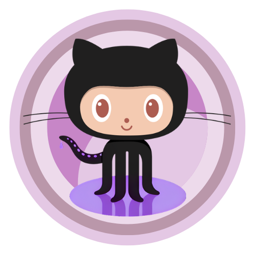

# Sobre o GitHub

Adquirido pela Microsoft em 2008, o GitHub é muito mais do que apenas uma plataforma de hospedagem de código-fonte. Atualmente, é amplamente reconhecido como a plataforma líder para colaboração em desenvolvimento de software, sendo utilizada pelas principais empresas de tecnologia do mundo.

Com mais de 100 milhões de pessoas desenvolvedoras e mais de 420 milhões de repositórios, o GitHub é um verdadeiro hub global para a comunidade de desenvolvimento. Empresas como Meta, Spotify, Dell, Ford, 3M, entre tantas outras, confiam no GitHub para hospedar e colaborar em seus projetos de software.

Além disso, o GitHub se orgulha de ser a maior comunidade de código aberto do mundo. Seus repositórios abrigam muitas das principais soluções open source, como Mozilla, Linux, Python, entre outros. Essa vasta coleção de projetos open source oferece acesso ilimitado e gratuito, permitindo qualquer pessoa desenvolvedora aprenda, contribua e colabore - isso tudo em uma escala global.

Através do GitHub, pessoas desenvolvedoras têm a oportunidade não apenas de acessar uma enorme variedade de projetos, mas também de aprimorar suas habilidades, aprender com os melhores projetos e contribuir para o avanço da comunidade de software livre.

E não para por aí. O GitHub é mais do que uma plataforma de tecnologia - é um defensor da diversidade, inclusão e pertencimento. Com iniciativas como o MLH Fellowship e a GitHub Education, estão pavimentando o caminho para a próxima geração de desenvolvedores, tornando o desenvolvimento de software acessível para todos, independentemente de quem você é ou de onde vem. &#x20;

Então, por que você deve investir seu tempo para aprender sobre o GitHub? Porque é mais do que apenas aprender uma ferramenta - é se tornar parte de uma comunidade global de inovadores, criadores e solucionadores de problemas. É abrir as portas para um mundo de **oportunidades** e adquirir **habilidades** que são valorizadas pelas principais empresas de tecnologia e fazer parte de uma **comunidade** que está moldando o futuro do desenvolvimento de software. É sobre aprender, colaborar e construir um futuro melhor juntos. Vamos?!

<figure><figcaption>
GitHub e Cumbuca Dev
</figcaption></figure>

