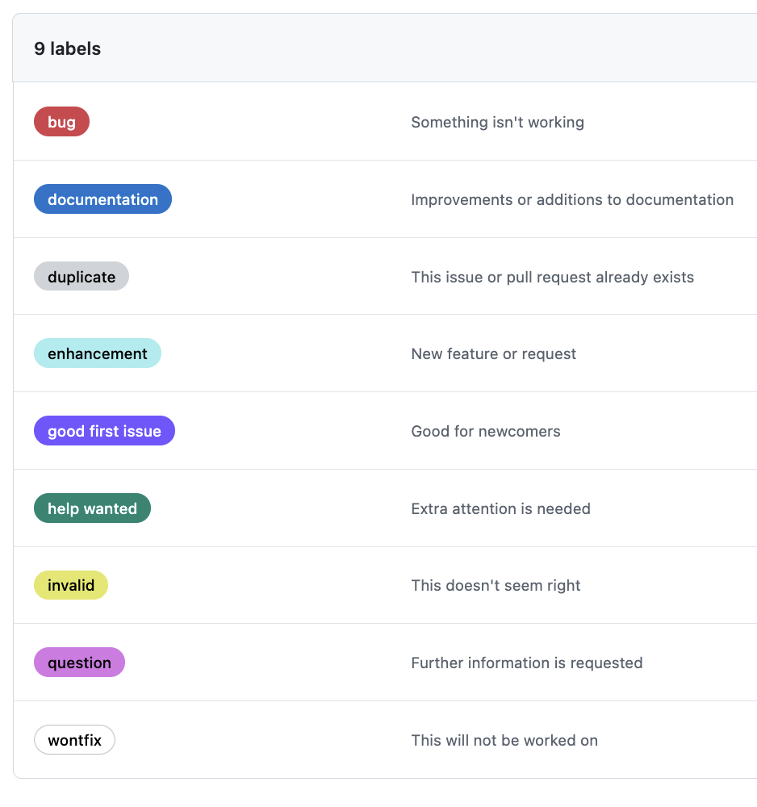

# Criando um PR no GitHub

O GitHub tem a documentação oficial explicando como criar um Pull Request [Guia Oficial do GitHub](https://docs.github.com/pt/pull-requests/collaborating-with-pull-requests/proposing-changes-to-your-work-with-pull-requests/creating-a-pull-request). Aqui, vamos direto à prática e criar um PR para a `Issue #1` do seu repositório **hello-world**.

Pode parecer desnecessário abrir um PR quando você mesmo vai revisá-lo e aceitá-lo, mas isso tem seu valor, mesmo em repositórios com apenas uma pessoa contribuindo. Manter um histórico organizado facilita o rastreamento de mudanças e a reversão de alterações caso necessário. Além disso, cada PR pode conter descrições detalhadas e servir como um registro das decisões tomadas, funcionando como uma espécie de anotação para consultas futuras. Seguir esse fluxo também tem um propósito didático, ajudando a internalizar boas práticas de colaboração e preparando o ambiente para quando mais pessoas começarem a contribuir no repositório.

Agora, vamos criar um Pull Request!

## Acessar a Página de Criação de Pull Request <a href="#criando-sua-primeira-issue" id="criando-sua-primeira-issue"></a>

Se houver um painel indicando que a branch `issue-1` recebeu alterações recentemente (exemplo: "issue-1 had recent pushes X minutes ago"), clique no botão Compare & pull request.

<figure><figcaption></figcaption></figure>

Caso esse painel não esteja mais visível, siga estas etapas:

1. Trocar para o branch `issue-1`, caso não esteja nele ainda.\
   Faça isso, acessando a lista de branches e selecionando `issue-1`.

<figure><figcaption></figcaption></figure>

<figure><figcaption></figcaption></figure>

2. Clique no botão **Contribute**.

<figure><figcaption></figcaption></figure>

<figure><figcaption></figcaption></figure>

3. Escolha a opção **Open pull request** para iniciar o processo.

<figure><figcaption></figcaption></figure>

<figure><figcaption></figcaption></figure>

A mensagem na caixa de diálogo _"This branch is **1** commit ahead of main"_ indica que a branch atual (`issue-1`) tem **1** commit que ainda não foram incorporados à branch `main`. Ou seja, que a branch `issue-1` está um commit a frente da branch `main`. Isso significa que alterações foram feitas e é necessário abrir um Pull Request para que possam ser revisadas e, caso aprovadas, mescladas ao código principal.

## Criar de Pull Request <a href="#criando-sua-primeira-issue" id="criando-sua-primeira-issue"></a>

### 1. Certifique-se que o branch de origem e o branch de destino estão corretos

O branch de origem deve ser `issue-1` e o de destino `main`:&#x20;

> &#x20;`main ← issue-1`&#x20;

<figure><figcaption></figcaption></figure>

Isso garante que as alterações feitas em `issue-1` serão enviadas para `main`.

### 2. Confira o título

Como o Pull Request tem apenas um commit, o GitHub já preencheu o título com a mensagem deste commit. Portanto, apenas certifique-se de que ele está claro e descritivo.

<figure><figcaption></figcaption></figure>

Neste caso, podemos prosseguir mantendo o título `Adicionando GIF de boas vindas ao README.md`.

### 3. Preencha a descrição

Na caixa de descrição, precisamos fornecer um resumo das alterações e a motivação para elas.

<figure><figcaption></figcaption></figure>

Preencha-a com:

```markdown
# Adicionando GIF de boas vindas ao README.md

* **Descrição**: Adiciona um GIF de um pinguim acenando ao final do README.md.
* **Motivação**: Criar uma experiência mais amigável e acolhedora para quem visita o repositório
* **Issue Relacionada**: Closes #1
```

O uso de `Closes #1` garante que a Issue #1 será fechada automaticamente quando o PR for mesclado.

<figure><figcaption></figcaption></figure>

Faça também a pré-vizualização da descrição formatada para garantir que tudo está sendo exibido como o esperado.

<figure><figcaption></figcaption></figure>

### 4. Confira as modificações

Antes de criar o PR, revise as mudanças para garantir que tudo está correto.

<figure><figcaption></figcaption></figure>

Confira também o arquivo README.md formatado para garantir que tudo está sendo exibido como o esperado

<figure><figcaption></figcaption></figure>

### 5. Crie o pull request

Após preencher todas as informações e revisar as mudanças, clique em **Create pull request** para enviar.

<figure><figcaption></figcaption></figure>

<figure><figcaption></figcaption></figure>

Parabéns, o seu primeiro Pull Request foi criado com sucesso!

### **6. Adicione labels**

Labels ajudam a categorizar os PRs e podem ser adicionadas tanto na criação quanto após a abertura do PR. Neste exemplo, adicione a label `documentation` para indicar que o PR corresponde a uma atualização na documentação.


1. No menu lateral direito, clique na engrenagem ao lado da palavra **Labels**.\
    (2).png>)
2. Selecione a label **documentation (documentação)**.\
    (2).png>)
3. Verifique se a label foi adicionada corretamente ao seu PR.\
    (2).png>)

***


Note que não adicionamos pessoas revisoras. Como este é um projeto individual sem outras pessoas colaborando no repositório até o momento, não há ninguém para atribuir à revisão. Além disso, o GitHub não permite definir a própria conta para essa função. Por isso, essa etapa pode ser ignorada por enquanto. Mais adiante, abordaremos esse processo com este mesmo exemplo.


Na próxima seção, vamos explorar em mais detalhes a página do Pull Request, analisando seus elementos e como utilizá-los para um fluxo de trabalho eficiente.
