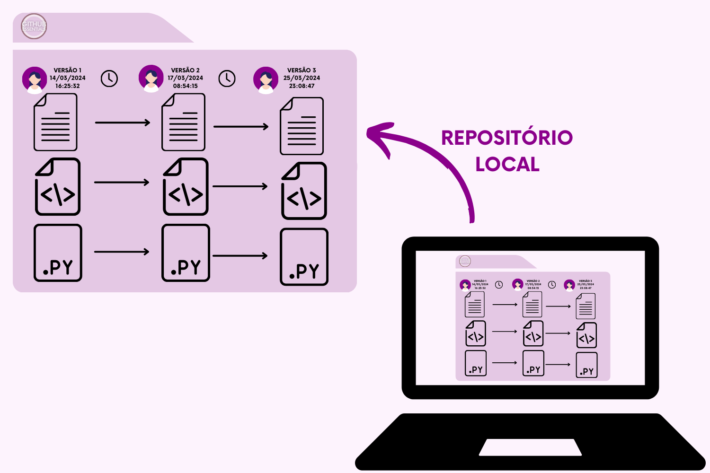
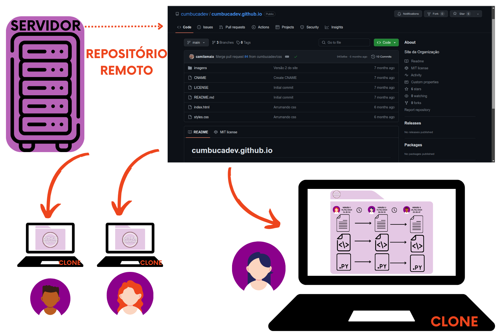
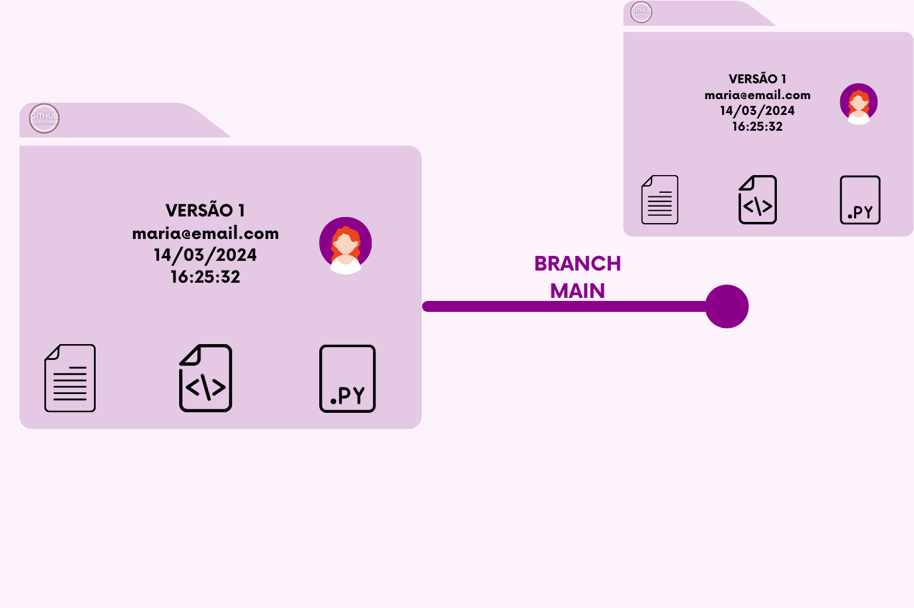
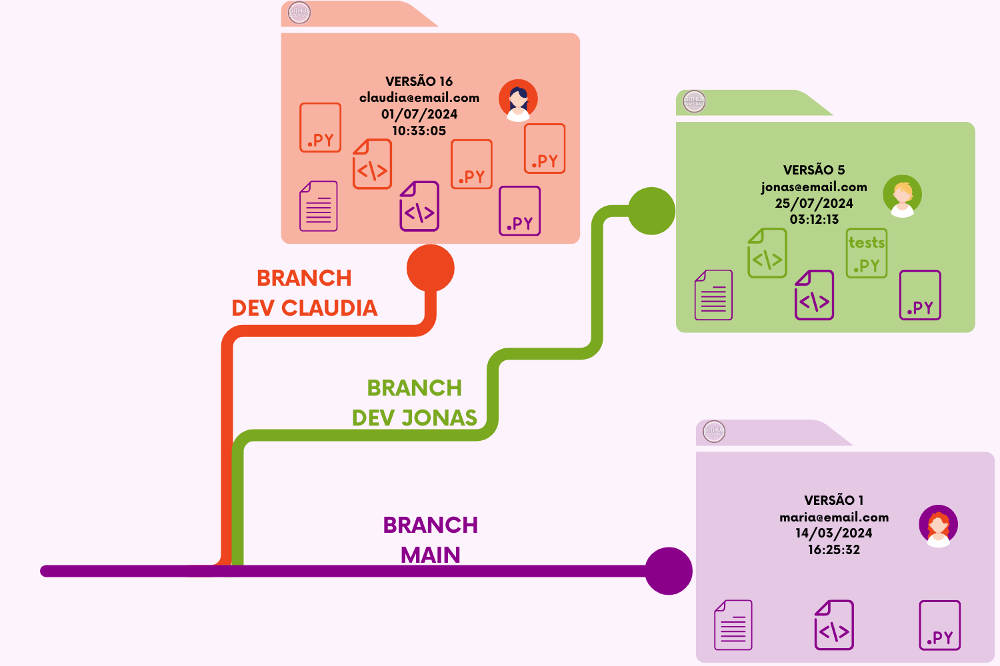
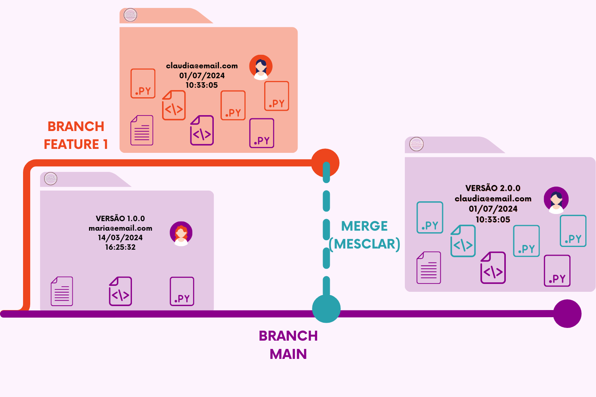

# Principais Conceitos

### Repositório

É a maior unidade de armazenamento, um local de que contém todos os seus códigos, arquivos e o histórico da revisão de cada arquivo - como se fosse uma grande pasta com todos esses arquivos e metadados. Ele pode ser conhecido também como _repo_, e ser local (no seu computador) ou remoto (em um servidor, como o GitHub).&#x20;

<figure><figcaption>
Repositório: quando apenas na máquina - local.
</figcaption></figure>

Seu uso pode ser individual ou compartilhado com vários outros colaboradores, além de ter a possibilidade de ser privado (empresas, projetos pessoais...) ou público (uma das principais características de qualquer projeto que seja Open Source). Mas não se engane: mesmo quando a visualização do código é aberta ao público, para acessar o repositório principal você precisa ter uma permissão para poder fazer alterações nele, mas falaremos disso mais à frente!

<figure><figcaption>
Um Repositório Remoto, no GitHub, tem essa aparência!
</figcaption></figure>

### Branch

#### :flag\_br:Galho, ramificação

Uma das grandes vantagens de utilizar esse tipo de sistema é a criação das branches, que são - como o próprio nome já explica - "ramificações" do código original. Sempre que você cria um novo repositório, uma Branch Principal é criada, e por padrão, o Git dá à essa branch o nome de _main_ (você ainda pode encontrar algumas com o [nome _master_](https://www.zup.com.br/blog/termo-master-na-tecnologia)). A branch main - em seu período inicial - contém todas as informações do repositório atual, com os mesmos arquivos e códigos.

<figure><figcaption>
Branch <code>main</code> possui todos os arquivos e dados da pasta inicial (principal).
</figcaption></figure>

Mas as branches não param por aí, pois a maior função delas é serem linhas independentes de desenvolvimento em um repositório, assim podem conter versões paralelas do código sem afetar a branch principal _(main)_. Além disso, as branches ajudam a organizar e gerenciar o fluxo de trabalho de uma equipe de desenvolvimento. Aqui estão algumas das funções mais comuns quando o assunto é branch:

* **Desenvolvimento Paralelo**: As branches permitem que diferentes desenvolvedores trabalhem em diferentes funcionalidades ou correções simultaneamente, sem interferir no trabalho um do outro. Cada desenvolvedor pode ter sua própria branch para implementar e testar suas alterações.

<figure><figcaption>
Branch <code>main</code> continua contendo a mesma "pasta inicial", mas o Desenvolvedor Jonas e a Desenvolvedora Claudia possuem branches diferentes, cada um desenvolvendo sua especialidade.
</figcaption></figure>

* **Isolamento de Funcionalidades ou Correções**: Cada branch representa uma unidade de trabalho isolada. Isso significa que as mudanças feitas em uma branch não afetam diretamente o código em outras branches até que essas mudanças sejam **mescladas** de volta à branch principal.

<figure><figcaption>
Branch <code>main</code> segue igual, enquanto isso, na branch <code>feature1</code> acontecem atualizações e a criação de uma nova funcionalidade.
</figcaption></figure>

* **Testes e Experimentações**: As branches também podem ser usadas para testar novas funcionalidades ou experimentações sem comprometer o código da branch principal. Se uma experimentação não der certo, ela pode ser descartada sem afetar o código principal.

<figure><figcaption>
Ainda bem que o Dev Jonas se ligou nas boas práticas e antes de fazer os novos testes    fez uma branch chamada <code>tests1.</code>Depois de um tempo, eles não se comportaram da forma esperada, foi mais fácil de deletar a branch sem fazer nenhuma alteração na branch <code>main</code>. 
</figcaption></figure>

* **Gerenciamento de Versões**: As branches também podem ser usadas para gerenciar diferentes versões de um projeto. Por exemplo, uma branch pode ser usada para manter a versão atual do software enquanto outra branch é usada para desenvolver uma versão futura.

<figure><figcaption>
Neste exemplo o nosso Repositório conta, além da branch principal (<code>main</code>) - que contém a primeira versão do código (1.0.0), mais duas: uma chamada <code>tests1</code> e outra que contém a <code>versão 2.0.0</code>. A branch main recebe um <em>merge</em> da <code>tests1,</code> você consegue perceber quais as mudanças?
</figcaption></figure>

### Merge

#### :flag\_br: Fundir, misturar, mesclar

Se os códigos antes foram isolados, agora é hora de juntar! O merge permite integrar as alterações feitas em uma branch de desenvolvimento de volta à branch principal (`master` ou `main`). Isso garante que as novas funcionalidades, correções ou melhorias feitas em branches secundárias estejam disponíveis na branch principal do projeto.

<figure><figcaption>
Aqui, a branch <code>main</code> é mesclada com a branch <code>feature1</code>, recebendo os novos arquivos e atualizações na diretamente na branch principal após o merge.
</figcaption></figure>

### Fork

#### :flag\_br: Bifurcação, encruzilhada

O fork em um sistema de controle de versão, como o Git, é utilizado para permitir que um usuário faça uma cópia independente de um repositório existente. Ele copia os arquivos originais e cria um repositório idêntico, na conta de outro usuário. Suas principais funções são:

1. **Desenvolvimento Independente**: Um fork permite que um usuário crie uma cópia separada de um repositório existente. Isso permite que o usuário desenvolva funcionalidades, faça correções ou experimente alterações sem afetar diretamente o repositório original. Essa independência é útil, especialmente em projetos de código aberto, onde diferentes colaboradores podem ter diferentes visões ou abordagens para o projeto.&#x20;

<figure><figcaption>
Claudia adorou o repositório que a Maria fez, mas queria incluir algumas funcionalidades que no seu dia a dia faria mais sentido. Primeiro ela faz o fork e traz para si o repositório com todos os dados e metadados presentes no Repositório Original. 
</figcaption></figure>

1. **Contribuição para Projetos de Código Aberto**: Em projetos de código aberto hospedados em plataformas como o GitHub, os forks são frequentemente usados para permitir que os colaboradores que ainda não possuem acesso à efetuar alterações no projeto principal. Um colaborador faz um fork do repositório original, faz as alterações desejadas em sua própria cópia do repositório e, em seguida, envia uma solicitação para que suas alterações sejam revisadas e, potencialmente, mescladas de volta ao repositório original.

<figure><figcaption>
Perceba: o Repositório Original continua da mesma forma, sem qualquer alteração, enquanto o repositório da Claudia é atualizado por ela com as features necessárias para uso próprio. Ela é muito prevenida, e  mesmo no seu fork abriu a branch <code>feature1</code> para poder desenvolver seu código sem dores de cabeça futuros. 
</figcaption></figure>

### Commit&#x20;

#### :flag\_br: Comprometer, registrar

Um commit é uma "foto" do estado atual do repositório. Ele registra quais mudanças foram feitas, por quem e quando. Sendo uma parte fundamental do fluxo de trabalho do Git, permite o registro, acompanhamento e reversão de alterações no código-fonte de um projeto. Os commits são a base para o versionamento de código e colaboração eficaz entre desenvolvedores.

<figure><figcaption>
Nesta imagem temos 2 commits diferentes, e cada um possui seu próprio ID, informações de autoria, data/hora e uma breve descrição. Eles se comportam como um "print screen" que capta todas essas informações no momento em que o Desenvolvedor "<em>commita"</em> essas atualizações. 
</figcaption></figure>
