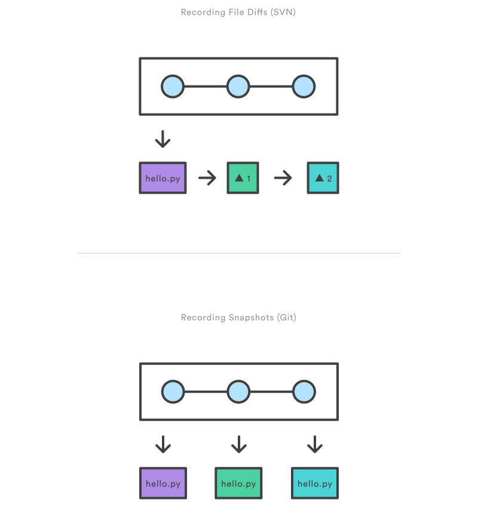

# git commit

## Como Funciona

O comando <mark style="color:purple;">git</mark> <mark style="color:orange;">commit</mark> é utilizado para salvar as alterações feitas no repositório. Pense no git commit como um comando para salvar, mas ele é especial porque pode salvar várias alterações de uma vez, não apenas uma.

O commit funciona como uma câmera que tira uma "foto" (ou "_snapshot_") do seu projeto naquele exato momento. Essa "foto" captura todas as mudanças que foram preparadas (ou "staged") usando o comando <mark style="color:purple;">git</mark> <mark style="color:orange;">add</mark>, além de tudo que já estava presente no repositório anteriormente. Esses "fotos" podem ser consideradas versões "seguras" do projeto — o Git nunca as alterará, a menos que você solicite explicitamente.

Antes da execução do <mark style="color:purple;">git</mark> <mark style="color:orange;">commit</mark>, o comando <mark style="color:purple;">git</mark> <mark style="color:orange;">add</mark> é utilizado para promover ou "preparar" as alterações no projeto que serão armazenadas em um commit. Esses dois comandos, <mark style="color:purple;">git</mark> <mark style="color:orange;">commit</mark> e <mark style="color:purple;">git</mark> <mark style="color:orange;">add</mark>, estão entre os mais frequentemente utilizados.

#### As alterações são locais

Quando você faz um commit, as mudanças são salvas localmente no seu computador. Isso significa que elas ainda não estão disponíveis para outras pessoas. As mudanças ainda não estão presentes no repositório central.

> imagem:&#x20;

**Vantagens de alterações locais:**

1. **Independência:** Você pode trabalhar de forma independente e fazer quantas mudanças precisar sem afetar o trabalho de outras pessoas.
2. **Segurança:** Você tem controle total sobre quando e como compartilhar suas alterações, permitindo que você refine e teste seu trabalho antes de disponibilizá-lo.

#### Snapshots, não diferenças

Uma das características mais importantes do Git é que ele salva "snapshots" (fotos) do projeto, não apenas as diferenças entre as versões. Isso significa que cada commit é uma cópia completa do estado do projeto naquele momento.

<figure><figcaption>
Algo melhor que isso, mas nessa linha kkkk fonte: <a href="https://www.atlassian.com/git/tutorials/saving-changes/git-commit">https://www.atlassian.com/git/tutorials/saving-changes/git-commit</a>
</figcaption></figure>

**Benefícios dos snapshots:**

1. **Segurança:** Cada commit é uma versão completa e segura do projeto. Se algo der errado, você pode sempre voltar a um estado anterior.
2. **Histórico Claro:** Ter snapshots completos facilita entender o estado do projeto em qualquer ponto no tempo.
3. **Restauração Simples:** Se precisar voltar a um estado anterior, você tem uma imagem completa do projeto, sem precisar recompor todas as mudanças uma por uma.

## **Estrutura**

O formato base do comando <mark style="color:purple;">git</mark> <mark style="color:orange;">commit</mark> é:

> <mark style="color:purple;">git</mark> <mark style="color:orange;">commit</mark> <mark style="color:blue;">\[opções]</mark>

## **Exemplos de uso**

* Realizar o commit do snapshot preparado
  * <mark style="color:purple;">git</mark> <mark style="color:orange;">commit</mark>&#x20;
  * Isso abrirá um editor de texto solicitando uma mensagem de commit. Após inserir uma mensagem, salve o arquivo e feche o editor para criar o commit real.
* Criar imediatamente um commit com uma mensagem de commit fornecida
  * <mark style="color:purple;">git</mark> <mark style="color:orange;">commit</mark> <mark style="color:blue;">-m "mensagem do commit"</mark>
  * Por padrão, git commit abrirá o editor de texto localmente configurado e solicitará a inserção de uma mensagem de commit. Passar a opção -m irá dispensar o prompt do editor de texto em favor de uma mensagem inline.


Esta é uma explicação simplificada para fins didáticos. Para explorar todas as possibilidades do comando <mark style="color:purple;">`git`</mark><mark style="color:orange;">`commit`</mark>, consulte a [documentação oficial](https://git-scm.com/docs/git-commit/pt\_BR).

