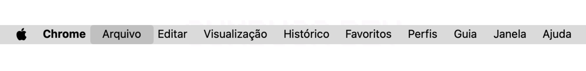

# Editando README.md

Chegamos no momento de fazer as alterações no arquivo README.md da cópia local do repositório segundo requisitos da issue criada na seção[criando-uma-issue-no-github.md](../../../dia-8-minha-primeira-issue/criando-uma-issue-no-github.md "mention").

## Passo a Passo

### 1. Abrindo o Visual Studio Code

O primeiro passo é abrir a aplicação **Visual Studio Code**, que foi instalada anteriormente.

Ao abrir o VSCode, será exibida a aba **Bem-vindo**. Essa aba apresenta atalhos para abrir projetos, acessar documentação e personalizar o editor.&#x20;

<figure><figcaption></figcaption></figure>

No entanto, não iremos utilizá-la agora, então podemos fechá-la clicando no **X** no canto da aba.

<figure><figcaption></figcaption></figure>

O editor ficará assim:

<figure><figcaption></figcaption></figure>

### 2. Abrindo a pasta do repositório

Agora, vamos abrir a pasta do repositório no editor. Para isso, clique em **Arquivo** na barra de menu no topo da tela.

<figure><figcaption></figcaption></figure>

Selecione **Abrir Pasta...**.

<figure><figcaption></figcaption></figure>

Encontre a pasta do repositório `hello-world`, selecione-a e clique em **Abrir**.

<figure><figcaption></figcaption></figure>

O editor agora exibirá os arquivos do repositório na barra lateral esquerda. Neste caso, apenas o README.md.

<figure><figcaption></figcaption></figure>

### 3. Abrindo o arquivo README.md

Na barra lateral esquerda, clique no arquivo **README.md** para abri-lo. O conteúdo do arquivo será mostrado no painel central da tela, onde você poderá editá-lo.

<figure><figcaption></figcaption></figure>

Antes de começarmos a edição, vamos visualizar como o arquivo fica formatado. Para isso:

1. Clique no ícone de **Pré-Visualização** no canto superior direito.\
   .png>)
2. O VSCode abrirá uma visualização formatada do Markdown ao lado direito, mostrando como o arquivo será exibido no GitHub.

<figure><figcaption></figcaption></figure>

Agora, temos três principais áreas visíveis no editor:

* **Barra lateral esquerda**: Lista os arquivos do repositório.
* **Painel central**: Área onde editamos o README.md.
* **Painel da direita**: Pré-visualização do Markdown formatado.

### 4. Editando o arquivo

Podemos adicionar o exemplo sugerido na descrição issue ao final do arquivo.

```markdown

```

<figure><figcaption></figcaption></figure>

### 5. Escolhendo uma imagem ou GIF

Para encontrar uma imagem ou GIF para ilustrar a seção de boas-vindas, pode-se buscar diretamente no [Google Images](https://images.google.com/) usando, por exemplo, os termos **"gif boas-vindas"**.

<figure><figcaption></figcaption></figure>

Após escolher a que mais lhe agrada, clique na própria imagem para abri-lo.

<figure><figcaption></figcaption></figure>

Por fim, clique com o botão direito na imagem que se abriu a direita e selecione **Copiar endereço da imagem**.

<figure><figcaption></figcaption></figure>

Agora, é só substituir o link no README.md pelo URL real do GIF:

```markdown

```

<figure><figcaption></figcaption></figure>

Perceba que automaticamente a pré-visualização já mostrará a sua imagem no texto formatado.

### 6. Alterando o texto alternativo (alt text)

O **texto alternativo (alt text)** é o texto incluído no código para descrever uma imagem em um site. Ele é fundamental para pessoas que utilizam ferramentas para leitura de tela, como é o caso das pessoas com deficiência visual.

Além de sua principal função, o alt text também pode ser útil em casos em que a imagem não carregue corretamente e também é uma ferramenta que ajuda os rastreadores de mecanismos de pesquisa a entenderem melhor o contexto da página.

Por isso, é uma boa prática sempre fornecer uma descrição clara e objetiva.

Podemos descrever nosso GIF da seguinte maneira:

> Gif de um filhote de pinguim fofo com olhos grandes e brilhantes. Está sentado no gelo, sorrindo e acenando. Ele tem um pedaço de casca de ovo rachado ainda preso na cabeça, sugerindo que acabou de nascer. O fundo mostra um ambiente gelado com o céu ao entardecer.

Basta, então, atualizar o valor do alt text no README.md:

```markdown

```

<figure><figcaption></figcaption></figure>

### 7. Salvando o arquivo

Agora que as alterações foram feitas, é necessário salvar o arquivo no VSCode. Antes, perceba que:

* Quando um arquivo tem mudanças não salvas, aparece um **ponto branco/preto** ao lado do nome da aba.\
  .png>)\

* Quando o arquivo é salvo, o ponto desaparece e um **X** aparece no lugar.\
  .png>)\

* Se houver arquivos não salvos, o VSCode também exibe a etiqueta **"1 não salvo"** na barra lateral esquerda.\
  .png>)

Para salvar o arquivo, clique em **Arquivo** no menu superior.

<figure><figcaption></figcaption></figure>

E selecione a opção **Salvar**.

<figure><figcaption></figcaption></figure>

Pronto, agora suas alterações estão salvas no seu computador! Perceba que agora aparece um **X** ao lado do nome do arquivo na aba e que o VSCode não mostra mais a etiqueta **"1 não salvo"**.

<figure><figcaption></figcaption></figure>

***

Embora o arquivo tenha sido salvo no seu computador, ele ainda não foi salvo no controle local de versão do Git. Salvar no VSCode apenas armazena as mudanças localmente no seu computador, enquanto salvar no Git registra as mudanças no sistema de controle de versão, permitindo rastreamento e colaboração.

No próximo passo, veremos como adicionar essas mudanças ao Git para garantir que elas sejam versionadas corretamente.
